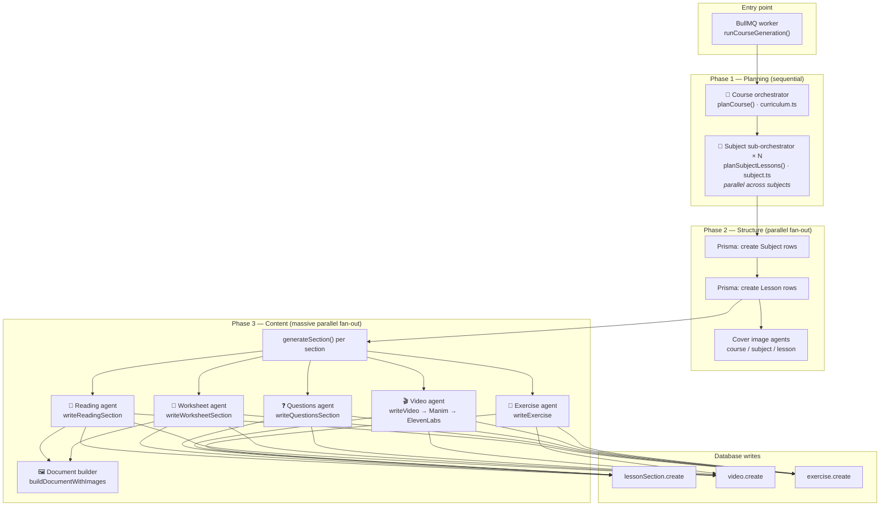
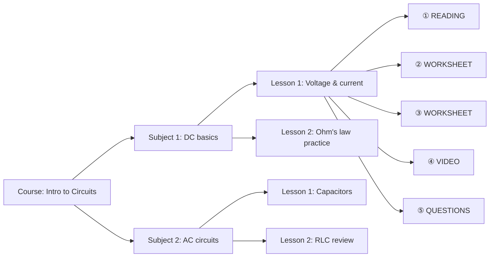
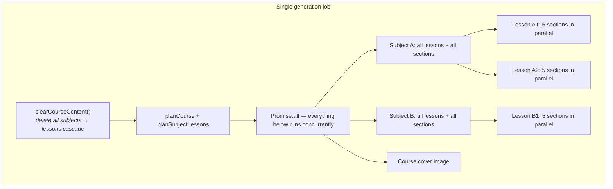
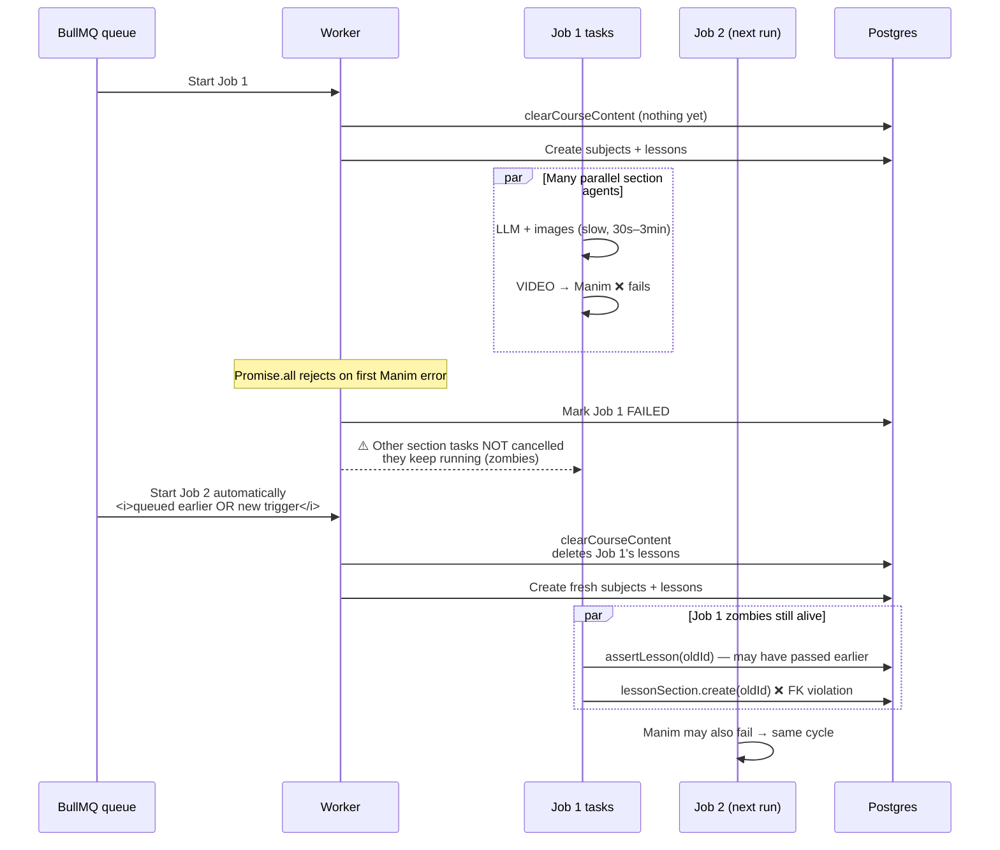

# Course generation: agent hierarchy & race condition

How Freeway builds a course with LLM agents, where parallelism comes from, and why `LessonSection_lessonId_fkey` errors can appear even when you did not click Regenerate.

---

## Data model (what gets written)

```
Course
 └── Subject (2–4 per course)
      └── Lesson (2–4 per subject)
           └── LessonSection (4–5 per lesson)
                READING | VIDEO | WORKSHEET | QUESTIONS | EXERCISE
```

Each section type is produced by a dedicated **content agent**. Planning happens in two orchestrator layers before any content is written.

---

## Agent hierarchy



### Layer summary

| Layer | Agent | File | Output |
|-------|--------|------|--------|
| **L0 — Pipeline** | `runCourseGeneration` | `pipeline.ts` | Coordinates everything, writes to DB |
| **L1 — Course orchestrator** | `planCourse` | `agents/curriculum.ts` | Course title, summary, 2–4 subjects + goals |
| **L2 — Subject sub-orchestrator** | `planSubjectLessons` | `agents/subject.ts` | 2–4 lessons per subject, each with 4–5 section *plans* (type only) |
| **L3 — Section agents** | `generateSection` switch | `pipeline.ts` + `agents/*` | Actual content per section type |
| **L3a — Reading / Worksheet** | `writeReadingSection`, `writeWorksheetSection` | `agents/text.ts` | Markdown draft |
| **L3b — Document builder** | `buildDocumentWithImages` | `agents/documents.ts` | Markdown + generated/SERP images |
| **L3c — Questions** | `writeQuestionsSection` | `agents/questions.ts` | Quiz JSON |
| **L3d — Video** | `writeVideo` + Manim + TTS | `agents/video.ts`, `render/manim.ts` | Video file + audio + DB row |
| **L3e — Exercise** | `writeExercise` | `agents/exercise.ts` | Interactive exercise config |
| **Side — Cover images** | `generateCourseImage`, etc. | `agents/cover-image.ts` | Course / subject / lesson cover URLs |

---

## Sample course tree (what one run produces)

Example for a 2-subject course:



All lessons across all subjects generate **at the same time**. All sections within a lesson generate **at the same time**. A typical run may have **40–80+ concurrent async tasks** (LLM calls, image gen, Manim, TTS).

---

## Parallelism inside one job



Relevant code shape in `pipeline.ts`:

```
Promise.all([
  courseCoverPromise,
  Promise.all(subjects.map(subject =>
    Promise.all([
      subjectImagePromise,
      Promise.all(lessons.map(lesson =>
        Promise.all([
          lessonImagePromise,
          ...sections.map(sec => generateSection(...))  // all sections at once
        ])
      ))
    ])
  ))
])
```

---

## The race condition

### What `LessonSection_lessonId_fkey` means

Postgres is rejecting `lessonSection.create` because the `lessonId` in that row **does not exist** in the `Lesson` table at insert time.

The pipeline already checks `assertLesson(lessonId)` before writing. The error means: **the lesson existed when we checked, but was gone by the time we inserted** — or we're holding an ID from an **older run** whose lessons were already deleted.

### Sequence diagram (why FK errors flood the log)



### Three important facts

1. **JavaScript does not cancel `Promise.all` siblings.** When Manim throws, the pipeline `catch` runs and the job is marked `FAILED`, but every other in-flight `generateSection()` keeps going. Those are **zombie tasks**.

2. **`clearCourseContent` runs at the start of every new job** and deletes all subjects for that course. Lessons are removed by cascade. Any zombie still holding a **previous run's** `lessonId` will hit FK errors.

3. **Guards are too early.** `assertActiveJob` and `assertLesson` run before slow work (`buildDocumentWithImages`, Manim, etc.), not immediately before `create`. There is a wide window where the DB changes underneath a running task.

---

## “I didn’t click anything — why did it happen?”

You do not need to press **Regenerate** for the overlap to occur. Common automatic paths:

| Trigger | What happens |
|---------|----------------|
| **Queued second job** | A second `generationJob` was already in Redis (double submit, earlier retry, tab refresh + duplicate POST in dev, etc.). When Job 1 fails, the worker **automatically** picks up Job 2. Job 2's `clearCourseContent` deletes Job 1's lessons while Job 1's zombies are still writing. |
| **Worker still processing after failure** | BullMQ considers Job 1 "done" when `runCourseGeneration` throws — but zombie promises are not awaited. The worker immediately starts the next queued job while zombies from the failed job are still alive. |
| **DB reset while worker runs** | `prisma migrate reset` or wiping Supabase while `npm run worker` is active removes all lessons. In-flight tasks still hold old IDs → FK errors. |
| **Manim fails on every run** | Each failure spawns a new batch of zombies. If anything triggers another generation pass (queued job, dev hot reload re-enqueue, etc.), you see the same FK spam again. |

The generating page **does not auto-retry** on failure — it only polls. So the usual culprit is **Job 2 already being in the queue** or **zombies from the current/previous failed run colliding with a new run's `clearCourseContent`**.

---

## What the errors are (and are not)

| | |
|---|---|
| **Are** | Harmless failed inserts — no corrupt rows. Noise from stale async work targeting deleted lessons. |
| **Are not** | Proof that the planner generated invalid lesson IDs for the *current* run. |
| **Real blocker** | Whatever killed the job first (often `manim render exited 1`). FK spam is a **symptom** of uncancelled parallelism + content wipe on restart. |

---

## What would fix it (design direction)

Not implemented yet — listed here so the intent is clear:

1. **Cancellation token** — pass `AbortSignal` into every agent; check before every DB write; abort all siblings when one section fails.
2. **Await a shutdown grace period** — after failure, wait for in-flight tasks to finish or abort before starting cleanup / next job.
3. **Don't wipe until zombies are dead** — defer `clearCourseContent` until the previous run's async work is confirmed stopped (or use generation run IDs on rows instead of deleting).
4. **Serialize or cap parallelism** — fewer concurrent sections = fewer zombies (slower but safer).
5. **Fix Manim** — stops the primary failure that triggers the cascade.

---

## File map

```
src/workers/pipeline.ts          — orchestration, parallelism, DB writes
src/workers/agents/curriculum.ts — L1 course planner
src/workers/agents/subject.ts    — L2 lesson/section planner
src/workers/agents/text.ts       — reading + worksheet drafts
src/workers/agents/documents.ts  — image embedding + vision QA
src/workers/agents/questions.ts  — quiz sections
src/workers/agents/video.ts      — Manim script + narration spec
src/workers/agents/exercise.ts   — interactive exercises
src/workers/agents/cover-image.ts— course/subject/lesson covers
src/workers/index.ts             — BullMQ worker (concurrency: 1)
src/lib/queue.ts                 — enqueue vs inline fallback
src/lib/section-progress.ts    — clearCourseContent()
```
